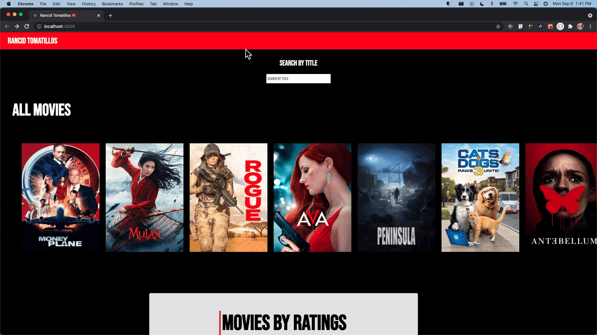

# Rancid Tomatillos
Module 3 Project for Turing School of Software and Design

## Contributors
  - [Matt Roden](https://github.com/Matt-Roden)
  - [Natalie McIntyre](https://github.com/nataliemcintyre2021)

## Table of Contents
  - [Abstract](#abstract)
  - [Technologies](#technologies)
  - [Code Architecture](#code-architecture)
  - [Illustrations](#illustrations)
  - [Wins](#wins)
  - [Challenges + Improvements](#challenges-+-Improvements)
  - [Project Specs](#project-specs)

## Abstract
Rancid Tomatillos is a movie rating desktop application where users can see information regarding movie ratings and additional movie details as well as interact with the application in various ways. This application allows the user to additionally interact with the application by scrolling through to see various movie titles, seeing all movie titles sorted by rating, clicking a sort button to re-sort the movie titles, using a live search feature to search for a specific movie, and clicking on a movie poster to see additional movie details.

Various technologies were used (as listed below) to meet the learning goals. The main learning goals of the project included:

- Create the entire project in React using Create React App
- Deepen understanding and competency with React
- Create a multi-page UX using React Router
- Use Cypress to test React components and asynchronous JavaScript
- Utilize proper error handling for failed fetch requests
- Expand knowledge of CSS and create a responsive, accessible design

## Technologies
  - React
  - React Router
  - Javascript
  - Cypress
  - HTML
  - CSS
  - Atom

## Code Architecture

Utilizing React, we designed this application to have a variety of class-based and functional components. Our decision to use
class components was based on recognizing if a particular component needed to keep track of and display data, and if that
component would update or change the data was displaying. Our structure with each component was carefully planned to make the code as modular as possible.

## Illustrations

## Wins
- We successfully focused on our learning goals to ultimately make those our priority over adding additional functionality (definitely room for many future iterations!)
- Successfully implemented new technologies being learned in Module 3
- As a team, leaned on each other's strengths, took time to solidify knowledge of new technologies both individually and together

## Challenges + Improvements
- Learning new technologies and implementing into project so immediately required extra self-study and facing new learning curves
- Tackling bugs in search bar feature - seeking to improve this functionality in future iterations
- Alongside updating search bar functionality, future iterations include creating additional components for our Loading and SearchBar elements, modifying our styling for our 404 page as well as Header and Footer components, create functionality for user to submit their own rating for individual movies, and continue to build a better UI/UX based on user feedback

## Project Specs
- The project spec & rubric can be found [here](https://frontend.turing.edu/projects/module-3/rancid-tomatillos-v3.html)
